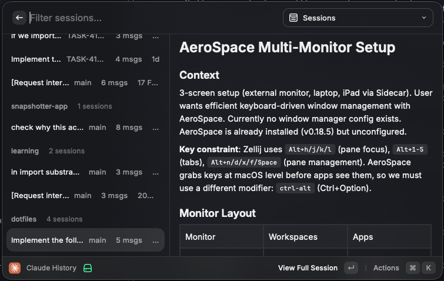

# Claude History

A [Raycast](https://raycast.com) extension to browse, search, and resume your [Claude Code](https://docs.anthropic.com/en/docs/claude-code) sessions.



## Features

- **Browse Sessions** — View all Claude Code sessions grouped by project, with conversation previews
- **Favourites** — Star sessions you want quick access to
- **Browse Projects** — Drill down into sessions by project
- **Search History** — Full-text search across all your Claude Code prompts
- **Resume Sessions** — Copy the resume command to paste into your terminal
- **Quick Actions** — Open projects in Finder or VS Code, copy session IDs

## Install

### From Source

Requires [Raycast](https://raycast.com) and [Node.js](https://nodejs.org/) (v18+).

```bash
git clone https://github.com/shubham-applore/claude-history.git
cd claude-history
npm install
npm run dev
```

This opens Raycast with the extension loaded in development mode. Search for **"Claude History"** to use it.

### Build

```bash
npm run build
```

## Usage

1. Open Raycast and search for **"Claude History"**
2. Use the dropdown to switch between views:
   - **Sessions** — All sessions sorted by most recent, grouped by project
   - **Favourites** — Your starred sessions
   - **Projects** — List of projects with drill-down to their sessions
   - **Search History** — Search across all prompts from `history.jsonl`
3. Select a session to see a conversation preview in the detail panel

### Keyboard Shortcuts

| Shortcut | Action |
|----------|--------|
| `Enter` | View full session conversation |
| `Cmd+R` | Copy resume command (`claude -r <id>`) |
| `Cmd+F` | Toggle favourite |
| `Cmd+O` | Open project in Finder |
| `Cmd+Shift+O` | Open project in VS Code |
| `Cmd+Shift+C` | Copy session ID |
| `Cmd+Shift+R` | Copy resume command |

### Resuming a Session

Press `Cmd+R` on any session to copy the resume command to your clipboard, then paste it into your terminal:

```bash
cd /path/to/project && claude -r <session-id>
```

## How It Works

The extension reads data from `~/.claude/` (read-only — it never writes to Claude's files):

- **`~/.claude/projects/<encoded>/`** — Session JSONL files containing conversation history
- **`~/.claude/history.jsonl`** — Index of all prompts with timestamps and project paths

Project paths are encoded by Claude Code (e.g., `/Users/me/my-project` becomes `-Users-me-my-project`). The extension uses filesystem-aware decoding to correctly handle directory names containing dashes.

Session scanning reads only the first 16KB of each file and caps at 60 sessions total, so it stays fast and within Raycast's memory limits even with large session files.

## License

[MIT](LICENSE)
